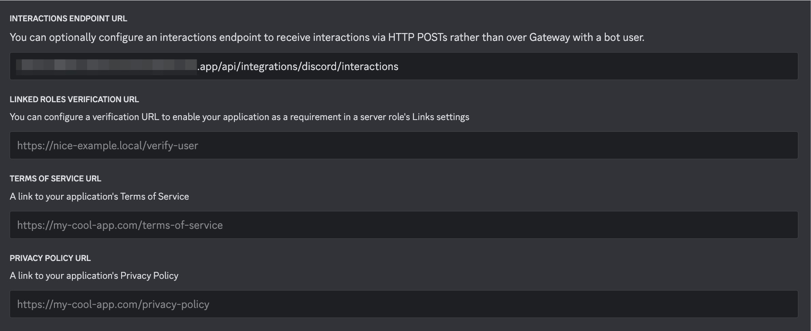

# Integrations

- [Integrations](#integrations)
  - [Setup Your Discord Dashboard](#setup-your-discord-dashboard)
  - [Connect To Your Local Deploy](#connect-to-your-local-deploy)
  - [Status Notices](#status-notices)

## Discord

### Setup Your Discord Dashboard

You need to follow these steps if you don't have an app yet: [Discord applications dashboard](https://discord.com/developers/applications)

Setup:

- install context: `Guild install`
- scopes: `application.commands` and `bot`
- permissions: `Send Messages` and `Manage Messages`

Once your application is set up in Discord's dashboard, you'll need to add some values to Rails credentials. You will need:

- application ID
- public key
- bot token

### Connect To Your Local Deploy

Every action the end user takes with Privy on Discord will trigger a request to an endpoint we must provide. This endpoint receives a POST request with a structure defined by Discord. We've set up the `/api/integrations/discord/interactions` endpoint.

To connect Discord, you'll need to expose your local server using a tool like Ngrok. If you're using Ngrok, run this command (assuming your app runs on port 3000):

```bash
ngrok http 3000
```

Next, paste the HTTPS link into the application's Discord dashboard. You should see two requests pointing to `/api/integrations/discord/interactions`: one with a `200` status code response and another with a `401`.


